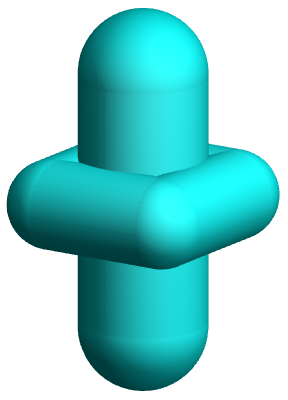
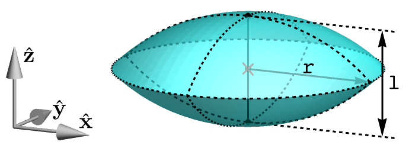
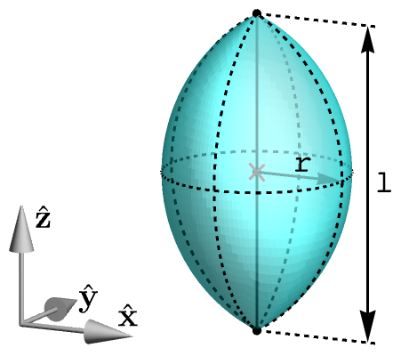

# Shapes

This reference contains information regarding shapes available in the software.

## Contents

* [Shape traits](#shape-traits)
  * [Shape axes](#shape-axes)
  * [Interactions](#interactions)
  * [Named points](#named-points)
* [Specific shape classes](#specific-shape-classes)
  * [Class `sphere`](#class-sphere)
  * [Class `kmer`](#class-kmer)
  * [Class `polysphere_banana`](#class-polyspherebanana)
  * [Class `polysphere_lollipop`](#class-polyspherelollipop)
  * [Class `polysphere_wedge`](#class-polyspherewedge)
  * [Class `spherocylinder`](#class-spherocylinder)
  * [Class `polyspherocylinder_banana`](#class-polyspherocylinderbanana)
  * [Class `smooth_wedge`](#class-smoothwedge)
  * [Class `polyhedral_wedge`](#class-polyhedralwedge)
* [General shape classes](#general-shape-classes)
  * [Class `polysphere`](#class-polysphere)
  * [Class `polyspherocylinder`](#class-polyspherocylinder)
  * [Class `generic_convex`](#class-genericconvex)
* [Soft interaction classes](#soft-interaction-classes)
  * [Class `hard`](#class-hard)
  * [Class `lj`](#class-lj)
  * [Class `wca`](#class-wca)
  * [Class `square_inverse_core`](#class-squareinversecore)

    
## Shape traits

This section and the following subsections gather general information regarding all shapes. It introduces notions, such
as [shape axes](#shape-axes) and [named points](#named-points), which are used in other parts of the documentation.


### Shape axes

Each shape has from 0 to 3 shape axes, usually perpendicular to one another. These are:

* **primary axis** - the main axis of the shape, usually in the longest direction
* **secondary axis** - the secondary direction, for example the direction of bending of squashing
* **auxiliary axis** - the axis orthogonal to both the primary axis and the secondary axis

The number of axes depends on the symmetry of the shape. For example, the [sphere](#class-sphere) has no axes,
[spherocylinder](#class-spherocylinder) has only the primary axis (along its length), while 
[polysphere banana](#class-polyspherocylinderbanana) has all three axes defined. If the primary and the secondary axes
are defined, the auxiliary axis is defined automatically as the normalized cross product of the former two axes; thus,
primary, secondary and auxiliary axes, in the given order, form a right-handed vector triad. 

Shape axes are used in many aspects of the software, for example, in observables:
[class `nematic_order`](observables.md#class-nematicorder),
[class `pair_averaged_correlation`](observables.md#class-pairaveragedcorrelation), trial moves:
[class `flip`](input-file.md#class-flip) and lattice transformers: 
[class `randomize_flip`](initial-arrangement.md#class-randomizeflip).


### Interactions

Each shape supports one or more interaction types. The basic interaction type is hard interaction, which is implemented
for all shapes. Some shapes also support soft interactions, such as Lennard-Jones or Weeks-Chandler-Anderson, in
particular the ones based on spheres: [class `sphere`](#class-sphere),
[class `polysphere_banana`](#class-polyspherebanana), [class `polysphere_wedge`](#class-polyspherewedge), etc. The list
of all soft interactions supported by various shapes can be found in
[Soft interaction classes](#soft-interaction-classes).


### Geometric center

Each shape defines the so-called *geometric center*. It usually is the center of the circumscribed sphere with the
smallest radius. It is one of the [named points](#named-points), and it is used, for example, as a point of rotation in
the [flip move](input-file.md#class-flip). For all [specific (built-in) shapes](#specific-shape-classes), the geometric
center is (0, 0, 0), however, it may be chosen in a different way in
[general (user-defined) shapes](#general-shape-classes).


### Named points

Each shape defines a set of the so-called *named points*. These are characteristic points (in shape's coordinate system)
such as for example centers of spherical caps of the [spherocylinder](#class-spherocylinder). Named points are
shape-specific, although the point named `"o"`, which is the geometric origin, is defined automatically for each shape.
Most of the shapes define the center of mass point `"cm"` as well. Named points are often used in observables, such as
[class `smectic_order`](observables.md#class-smecticorder) or [class `bond_order`](observables.md#class-bondorder).


## Specific shape classes

This section contains predefined shape classes, in contrast to less restricted
[General shape classes](#general-shape-classes). The list includes

* [Class `sphere`](#class-sphere)
* [Class `kmer`](#class-kmer)
* [Class `polysphere_banana`](#class-polyspherebanana)
* [Class `polysphere_lollipop`](#class-polyspherelollipop)
* [Class `polysphere_wedge`](#class-polyspherewedge)
* [Class `spherocylinder`](#class-spherocylinder)
* [Class `polyspherocylinder_banana`](#class-polyspherocylinderbanana)
* [Class `smooth_wedge`](#class-smoothwedge)
* [Class `polyhedral_wedge`](#class-polyhedralwedge)


### Class `sphere`

```python
sphere(
    r,
    interaction = hard
)
```


### Class `kmer`

```python
kmer(
    k,
    r,
    distance,
    interaction = hard
)
```


### Class `polysphere_banana`

```python
polysphere_banana(
    sphere_n,
    sphere_r,
    arc_r,
    arc_angle,
    interaction = hard
)
```


### Class `polysphere_lollipop`

```python
polysphere_lollipop(
    sphere_n,
    small_r,
    large_r,
    small_penetration = 0,
    large_penetration = 0,
    interaction = hard
)
```


### Class `polysphere_wedge`

```python
polysphere_wedge(
    sphere_n,
    bottom_r,
    top_r,
    penetration = 0,
    interaction = hard
)
```


### Class `spherocylinder`

```python
polysphere_wedge(
    l,
    r
)
```


### Class `polyspherocylinder_banana`

```python
polyspherocylinder_banana(
    segment_n,
    sc_r,
    arc_r,
    arc_angle,
    subdivisions = 1
)
```


### Class `smooth_wedge`

```python
smooth_wedge(
    l,
    bottom_r,
    top_r,
    subdivisions = 1
)
```


### Class `polyhedral_wedge`

```python
polyhedral_wedge(
    bottom_ax,
    bottom_ay,
    top_ax,
    top_ay,
    length,
    subdivisions = 1
)
```


## General shape classes

This section contains general shape classes with an extensive control over the shape. Especially flexible is the
[class `generic_convex`](#class-genericconvex), which, basing on Minkowski sums and convex hulls of predefined
primitives enables ones to craft most of reasonably-shaped convex particles. The list includes

* [Class `polysphere`](#class-polysphere)
* [Class `polyspherocylinder`](#class-polyspherocylinder)
* [Class `generic_convex`](#class-genericconvex)


### Class `polysphere`

```python
polysphere(
    spheres,
    volume,
    geometric_origin = [0, 0, 0],
    primary_axis = None,
    secondary_axis = None,
    named_points = {},
    interaction = hard
)
```


### Class `polyspherocylinder`

```python
polyspherocylinder(
    scs,
    volume,
    geometric_origin = [0, 0, 0],
    primary_axis = None,
    secondary_axis = None,
    named_points = {}
)
```




### Class `generic_convex`

```python
generic_convex(
    script,
    volume,
    geometric_origin = [0, 0, 0],
    primary_axis = None,
    secondary_axis = None,
    named_points = {}
)
```


|                                Illustration                                | Command, comments          | Comments                              |
|:--------------------------------------------------------------------------:|----------------------------|---------------------------------------|
|      | `point [x] [y] [z]`        |                                       |
|    | `segment [l]`              |                                       |
|  | `rectangle [ax] [ay]`      |                                       |
|     | `cuboid [ax] [ay] [az]`    |                                       |
|       | `disk [r]`                 |                                       |
|     | `sphere [r]`               |                                       |
|    | `ellipse [rx] [ry]`        |                                       |
|  | `ellipsoid [rx] [ry] [rz]` |                                       |
|     | `saucer [r] [h]`           | two spherical caps                    |
|   | `football [r] [h]`         | circle arch rotated around the z axis |


## Soft interaction classes

This section lists all soft interaction types available for selected shapes. The list includes

* [Class `hard`](#class-hard)
* [Class `lj`](#class-lj)
* [Class `wca`](#class-wca)
* [Class `square_inverse_core`](#class-squareinversecore)


### Class `hard`

### Class `lj`

### Class `wca`

### Class `square_inverse_core`