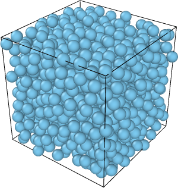
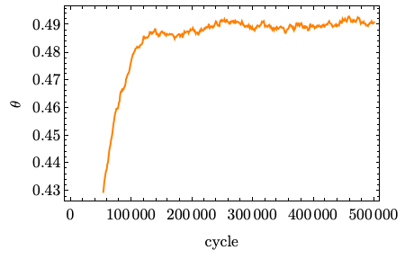
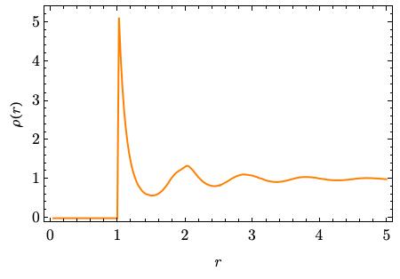

# Tutorial

Also: [see full Reference](reference.md)


## Contents

* [Installation](#installation)
* [Simulation model](#simulation-model)
  * [Example input file](#example-input-file)
  * [General parameters](#general-parameters)
  * [Run specification](#run-specification)
  * [Running the simulation](#running-the-simulation)
* [Data analysis](#data-analysis)
  * [Dumping final snapshot](#dumping-final-snapshot)
  * [Plotting observables](#plotting-observables)
  * [Computing radial distribution function](#computing-radial-distrubition-function)
* [Auxiliary tools](#auxiliary-tools)
  * [`preview` mode](#preview-mode)
  * [`shape-preview` mode](#shape-preview-mode)
* [Tips and tricks](#tips-and-tricks)
* [Error recovery](#error-recovery)


## Installation

There are various methods of installing the software. Compilation from the source code is available on all popular
OSes (Linux/macOS/Windows). For Linux, we also provide standalone static-linked binary (with no dependencies) as well
as DEB/RPM packages. See [Installation](installation.md) for a full instruction.


## Simulation model

The software has multiple operation modes, described in detail in [Operation modes](operation-modes.md). The central one
is `casino`, which it responsible for performing Monte Carlo sampling. The course of a simulation is controlled by an
input script in a PYON format, which is custom-desined, but easy to understand, since it is based on a Python syntax
incorporating primitives such as numbers, booleans, strings as well as arrays, dictionaries and classes (PYON stands for
*PYthon Object Notation*).


### Example input file

A concise example of the input which will be used in this Tutorial reads as follows

```python
rampack(
    version = "1.0",
    shape = sphere(r=0.5),
    arrangement = lattice(cell=sc, box_dim=15, n_shapes=1000),
    temperature = 1,
    pressure = 11.5,
    move_types = [translation(step=1)],
    box_move_type = delta_v(step=10),
    seed = 1234,
    handle_signals = True,
    runs = [
        integration(
            run_name = "liquid",
            thermalization_cycles = 500000,
            averaging_cycles = None,
            snapshot_every = 1000,
            output_last_snapshot = [ramsnap("packing_liquid.ramsnap")],
            record_trajectory = [ramtrj("recording_liquid.ramtrj")]
        )
    ]
)
```

It defines an NpT simulation of a hard-sphere liquid in a cubic box. The input file resembles creating a `rampack`
Python object with some arguments, and it is actually a good way to think about it. Complete documentation of the input
file format can be found in [Input file](input-file.md); however, we are going to briefly walk through all specified
options.


### General parameters

* `version = "1.0"`

It specifies that the input file is targeted at rampack versions 1.0 and above. One should set it to the current version
(which can be checked using `rampack --version`) when creating the input file and not change it later, even after
updating RAMPACK. This argument is a safeguard to facilitate a full backwards compatibility.

* `shape = sphere(r=0.5)`

It specifies that we will simulate [hard spheres](shapes.md#class-sphere) of radius 0.5. A different type of interaction
can be specified by `interaction` optional argument, for example `sphere(r=0.5, interaction=lj(epsilon=1, sigma=1))`.
Other supported shapes are for example [`spherocylinder`](shapes.md#class-spherocylinder),
[`kmer`](shapes.md#class-kmer), [`polysphere`](shapes.md#class-polysphere). Shapes are described in detail in
[Shapes](shapes.md).

* `arrangement = lattice(cell=sc, box_dim=15, n_shapes=1000)`

It specifies the initial arrangement of particles - in this case it is a
[`lattice`](initial-arrangement.md#class-lattice) class, which will create
[simple cubic](initial-arrangement.md#class-sc) lattice (`cell=sc`) in a cubic box of side length 15 (`box_dim=15`) with
evenly distributed 1000 spheres in it (`n_shapes=1000`), thus creating a 10 x 10 x 10 grid.

* `temperature = 1`
      
  `pressure = 11.5`

It sets the temperature (in k_B units) and pressure of the system to specified values.

* `move_types = [translation(step=1)]`

It is an Array `[...]` of particle move types that will be performed. Here, it is only
[translation](input-file.md#class-translation) with initial step size 1 (describing the extent of moves).

* `box_move_type = delta_v(step=10)`

It specifies that the box will be perturbed by [changing its volume](input-file.md#class-delta_v) by up to 10 (both when
shrinking and expanding). Specyfing `None` turns of box scaling making it an NVT simulation.

* `seed = 1234`

It specifies the RNG seed. Simulations with the same seed, under the same RAMPACK version and with the identical
multithreading specification should be completely reproducible.

* `handle_signals = True`

When `True`, `SIGINT` and `SIGTERM` will be captured and the program will exit gracefully having saved the data.


### Run specification

The parameter `runs` is an array `[...]` of runs that will be performed one after another. The initial configuration of
the first run is the one speficied by `arrangement = ...`. When the run is finished, its final state becomes the initial
state of the second run and so on. Each run has a unique name. Simulation environment parameters (`temperature`,
`pressure`, `move_types` and `box_move_type`) are inherited from the previous run (or from the general parameters), but
can be overridden by the run. For example, one can only vary the pressure between the runs - it is the most common use
case. Simulation output formats are also run-specific.

Here, we have a single run, which inherits the whole environment from the general parameters and outputs internal
[RAMSNAP](output-formats.md#class-ramsnap) representation of a final snapshot and internal
[RAMTRJ](output-formats.md#class-ramtrj) trajectory recording.

* `run_name = "liquid"`

It is a user-specified, unique name of the run. Only letters and numbers are allowed.

* `thermalization_cycles = 500000`

It specifies that 500,000 full MC cycles will be performed during the thermalization phase. One full cycle is as many
random particle moves as the number of particles plus a single box move.

* `averaging_cycles = None`

It turns off averaging (production) phase - it is not needed, since we do not collect observable averages nor bulk
observables (see [Observables](observables.md)).

* `snapshot_every = 1000`

It specifies that the system snapshot will be processed every 1000 cycles. Here, it only refers to capturing every
1000-th cycle in the trajectory file, but it also is used for the observables' output (if requested).

* `output_last_snapshot = [ramsnap("packing_liquid.ramsnap")]`

It is an array of formats in which the final simulation snapshot should be stored. Here, we store only
[RAMSNAP](output-formats.md#class-ramsnap) snapshot (internal RAMPACK textual representation) in the file named
*packing_liquid.ramsnap*. See [Output formats](output-formats.md) for more information about available output formats.

* `record_trajectory = [ramtrj("recording_liquid.ramtrj")]`

It is an array of formats in which simulation trajectory (a series of snapshots) should be stored. Here, we store only
[RAMTRJ](output-formats.md#class-ramtrj) trajectory (internal RAMPACK binary representation) in the file name
*recording_liquid.ramtrj*. See [Output formats](output-formats.md) for more information about available output formats.


### Running the simulation

Now that we are done with explaining the input file (let's say we name it `hs_liquid.pyon`), we can run the simulation
using the following command

```shell
rampack casino -i hs_liquid.pyon
```

First, some general info will be printed, then the state of the simulation will be reported every 100th cycle, and after
the simulation, performance summary will be given. This particular run should take under 5 minutes on a reasonably
modern system.


## Data analysis

Although it is possible, and often convenient, to perform some analysis on the fly (see for example
`sample_inputs/integration.pyon` input file), we didn't do it in our example. However, we generated the trajectory
output `recording_liquid.ramtrj` that can now be used to analyze the run. Recorded trajectories can be processed using
`rampack trajectory` mode. Executing

```shell
rampack trajectory -i hs_liquid.pyon --log-info
```

will show basic information about the trajectory. The `trajectory` mode reads input file passed using `-i` (`--input`)
option and processes the trajectory of the only run in this file. For multi-run simulation, the run whose trajectory
should be analyzed must be selected `-r [run name]` option. Then, at least one operation has to be specified - here, it
was `--log-info`.

We will now do 3 things:
1. Generate the final snapshot in XYZ format to inspect it visually
2. Plot the dependence of packing fraction on the number of cycles performed
3. Compute radial distribution function


### Dumping final snapshot

It is a good practice to visually inspect the final system snapshot before working with the results. We are going to
use the [(extended) XYZ](https://docs.ovito.org/reference/file_formats/input/xyz.html#extended-xyz-format) format, which
is easy to process in your favourite visualisation software. To do this, we execute

```shell
rampack trajectory -i hs_liquid.pyon -s 'xyz("liquid_snapshot.xyz")'
```

Option `-s` (`--output-snapshot`) instructs the software to output the last snapshot in the specified format and
`'xyz("liquid_snapshot.xyz")'` is a [PYON class](output-formats.md#class-xyz) representing XYZ format. The file name
should be given in double quotes `"..."`, as it is a PYON string and the whole expresstion should be enclosed in single
quotes `'...'` to prevent the shell from interpreting `( ) "` special characters.

In RAMPACK, XYZ files contain both particle and box data which enable one to open it directly in
[Ovito](https://www.ovito.org). Just remember to set spheres' radius to `0.5`, otherwise you will rush to
the [Issues](https://github.com/PKua007/rampack/issues) tab to report that the overlaps are present!




### Plotting observables

We shall execute

```shell
rampack trajectory -i hs_liquid.pyon -o liquid_observables.txt -O packing_fraction
```

Option `-o` (`--obs-output`) specifies the name of the file to store the
[observables](observables.md#normal-observables), while one or more `-O` (`--observable`) options specify which 
observables should be computed. Here, we are interested only in `packing_fraction`. RAMPACK will process all recorded
snapshots and report it on the fly on the standard output. The resulting `liquid_observables.txt` should look like this

```
cycle theta 
1000 0.086652790434454535 
2000 0.11068487456534945 
3000 0.1278854352671909
[...]
398000 0.49234741404900961 
399000 0.49230409898977856 
400000 0.49298684294431411 
```

We can now load it in our plotting software of choice.




### Computing radial distrubition function

From theta vs cycle plot, we can see that the packing fraction reaches its equilibrium value around 250,000-th cycle. We
can compute the [radial distribution function](https://en.wikipedia.org/wiki/Radial_distribution_function) averaging it
over system snapshots starting from the 250,000-th cycle. To do this, we execute

```shell
rampack trajectory -i hs_liquid.pyon -a 250000 -b liquid_{}.txt -B 'pair_density_correlation(max_r=5, n_bins=200, binning=radial)'
```

More complex observables, which are too large to fit in a single line andrequire their own output files, such as our RDF
are called [bulk observables](observables.md#bulk-observables). Option `-a` (`--averaging-start`) is used to point out
at which cycle number the averaging should start. `-b` (`--output-bulk-obs`) specifies output file name **pattern**,
where `{}` will be substituted by the name of the bulk observable. One or more `-B` (`--bulk-observable`) options
specify the bulk obseravables to calculate. Here, we are using
[`pair_density_correlation`](observables.md#class-pair_density_correlation) with the following arguments:

* `max_r=5` - specifies the cut-off radius on the plot
* `n_bins=200` - specifies the number of bins (plot resolution)
* `binning=radial` - specifies the binning type, i.e. what "radius" means. Here, we are dealing with a standard RDF, so
  we choose `radial` type, which searches for particles in spherical shells around the probed particle

In our case the observable is named `rho_r`, so the results will be stored to `liquid_rho_r.txt`. Having plotted it, we
are greeted with a typical RDF of a liquid with short-ranged correlations.




## Auxiliary tools

Although `casino` and `trajectory` modes are the ones we will use the most, the software is equipped with a few
additional tools which may prove useful in some scenarios. All modes are described in detail in
[Operation modes](operation-modes.md).


### `preview` mode

This mode's purpose is to generate the preview of the initial configuration in the input file. It may be useful when
a more complex initial arrangement is being prepared to inspect the result step by step. For example, the initial state
of the system from the tutorial can be exported to XYZ using

```shell
rampack preview -i hs_liquid.pyon -o 'xyz("liquid_preview.xyz")'
```

Option `-o` (`--output`) works exactly the same as `-s` option in the `trajectory` mode.


### `shape-preview` mode

This mode can be used to print information about a shape and generate its 3D model, which can be loaded in the
visualization software. The shape spec can be loaded from the input file, or specified manually. For example

```shell
rampack shape-preview -S 'spherocylinder(l=3, r=0.5)' -o 'obj("sc.obj")'
```

renders a spherocylinder in a [Wavefront OBJ](https://en.wikipedia.org/wiki/Wavefront_.obj_file) format, recognizable
by Ovito.


## Tips and tricks

This section contains various tricks that prove useful when working with the software.

* When `handle_signals` is toggled `True`, `SIGINT` and `SIGTERM` signals will result in a graceful exit. All requested
  formats of final snapshots will be dumped to corresponding files. Although it is only optional, one should make a
  habit of always outputing RAMSNAP - `ramsnap("filename.ramsnap")`. This is the internal format, which can then be used
  to resume the simulation:

  ```shell
  rampack casino -i input.pyon -c
  ```
  
* If the simulation has multiplie runs, using only `-c` (`--continue`) option in the above case will result in the
  continuation of the **FIRST** run, even if the run which was interrupted is not the first one further one. One has to
  specify which run to continue, or ever better, use `-s .auto` (`--start-from=.auto`).

  ```shell
  rampack casino -i input.pyon -s .auto
  ```
  
  It automatically gathers information about the runs (based on RAMSNAP files), finds the first unfinished one and 
  automatically appends `--continue` option if the run is not finished.

* If possible, you should record trajectories, even if you are computing observables on the fly. You never know which
  observables you may need to calculate in the future. However, keep in mind that although RAMTRJ is a compact binary 
  format, its size may grow quickly, easily reaching gigabytes for long simulations of large systems.

* Some PYON classes (for example `pair_density_correlation`) take multiple arguments. It may be difficult to remember
  them even after using it dozens of times. You can always use the [Reference](reference.md), but a crude way is to
  leave it without arguments `pair_density_correlation()` and let the error message guide you which arguments are
  required (I spent long days developing PYON error reporting, please do me a favor and make use of it :) ).


## Error recovery

RAMPACK software is PERFECT in every single aspect and
[NEVER had any bugs](https://github.com/PKua007/rampack/issues?q=is%3Aissue+label%3Abug), so OBVIOUSLY the only
situations when the simulation can be abruptly stopped are power outage, running out of disk space or a system crash. In 
case of some errors, RAMPACK may be able to gracefully finalize trajectory recording, so one can use the trajectory to
recreate RAMSNAP file and resume the simulation

```shell
rampack trajectory -i input.pyon -s 'ramsnap("name_of_the_ramsnap_file_from_input_file")'
rampack casino -i input.pyon -s .auto
```

In other situations, the trajectory may be truncated or trajectory header corrupted. To save many days of simulations
and thousands of precious core-hours on a computing cluster, RAMPACK can try to fix the trajectory. First, one can
execute 

```shell
rampack trajectory -i input.pyon --log-info
```

to check if the trajectory is intact, and if not, use

```shell
rampack trajectory -i input.pyon --auto-fix -t 'ramtrj("fixed_trajectory.ramtrj")'
```

to attempt trajectory fix and save the corrected one to `fixed_trajectory.ramtrj` file. `--auto-fix` will report how
many snapshots were restored. Usually only up to a couple of last snapshots are lost.


[&uarr; back to the top](#tutorial)