# Shapes

This reference contains information regarding shapes available in the software.

[&larr; back to Reference](reference.md)


## Contents

* [Shape traits](#shape-traits)
  * [Shape axes](#shape-axes)
  * [Interactions](#interactions)
  * [Named points](#named-points)
* [Specific shape classes](#specific-shape-classes)
  * [Class `sphere`](#class-sphere)
  * [Class `kmer`](#class-kmer)
  * [Class `polysphere_banana`](#class-polysphere_banana)
  * [Class `polysphere_lollipop`](#class-polysphere_lollipop)
  * [Class `polysphere_wedge`](#class-polysphere_wedge)
  * [Class `spherocylinder`](#class-spherocylinder)
  * [Class `polyspherocylinder_banana`](#class-polyspherocylinder_banana)
  * [Class `smooth_wedge`](#class-smooth_wedge)
  * [Class `polyhedral_wedge`](#class-polyhedral_wedge)
* [General shape classes](#general-shape-classes)
  * [Class `polysphere`](#class-polysphere)
  * [Class `polyspherocylinder`](#class-polyspherocylinder)
  * [Class `generic_convex`](#class-generic_convex)
* [Soft interaction classes](#soft-interaction-classes)
  * [Class `lj`](#class-lj)
  * [Class `wca`](#class-wca)
  * [Class `square_inverse_core`](#class-square_inverse_core)

    
## Shape traits

This section and the following subsections gather general information regarding all shapes. It introduces notions such
as [shape axes](#shape-axes) and [named points](#named-points), which are used in other parts of the documentation.


### Shape axes

Each shape has from 0 to 3 shape axes, usually perpendicular to one another. These are:

* **primary axis** - the main axis of the shape, usually in the direction of the longest dimension of the shape
* **secondary axis** - the secondary direction, for example the direction of bending of squashing
* **auxiliary axis** - the axis orthogonal to both the primary axis and the secondary axis

The number of axes depends on the symmetry of the shape. For example, the [sphere](#class-sphere) has no axes,
[spherocylinder](#class-spherocylinder) has only the primary axis (along its length), while 
[polysphere banana](#class-polyspherocylinder_banana) has all three axes defined. If both the primary and the secondary
axes are defined, the auxiliary axis is defined automatically as the normalized cross product of the former two axes;
thus, primary, secondary and auxiliary axes, in the given order, form a right-handed vector triad. 

Shape axes are used in many places throughout the software, for example, in observables:
[class `nematic_order`](observables.md#class-nematic_order),
[class `pair_averaged_correlation`](observables.md#class-pair_averaged_correlation), trial moves:
[class `flip`](input-file.md#class-flip) and lattice transformers: 
[class `randomize_flip`](initial-arrangement.md#class-randomize_flip).


### Interactions

Each shape supports one or more interaction types. The basic interaction type is hard-core interaction, which is
implemented for all shapes. Some shapes also support soft interactions, such as Lennard-Jones or
Weeks-Chandler-Anderson, in particular the ones based on spheres: [class `sphere`](#class-sphere),
[class `polysphere_banana`](#class-polysphere_banana), [class `polysphere`](#class-polysphere), etc. The list of all soft
interactions supported by various shapes can be found in [Soft interaction classes](#soft-interaction-classes).


### Interaction centers

Some shapes, for example the [sphere](#class-sphere), consist of only one part through which they interact with other
shapes. However, more complicated shapes, for example the [polysphere_banana](#class-polysphere_banana), consist of many
atomic parts (in the given example - the spherical beads) which interact pairwise with those of other shapes. These
parts are called *interaction centers*. To speed up the computation of interaction energy, the neighbor grid stores
individual interaction centers - thus, when the energy is computed, it is only done for center pairs which are close to
each other.


### Geometric center

Each shape defines the so-called *geometric center*. It usually is the center of the circumscribed sphere with the
smallest radius. It is one of the [named points](#named-points) (`"o"`), and it is used, for example, as a point of
rotation in the [flip move](input-file.md#class-flip). For all [specific (built-in) shapes](#specific-shape-classes),
the geometric center is {0, 0, 0}, however, it may be chosen in a different way in
[general (user-defined) shapes](#general-shape-classes).


### Named points

Each shape defines a set of the so-called *named points*. These are characteristic points (in shape's coordinate system)
such as for example centers of spherical caps of the [spherocylinder](#class-spherocylinder). Named points are
shape-specific, although the point named `"o"`, which is the geometric center, is defined automatically for each shape.
Most of the shapes define the center of mass point `"cm"` as well. Named points are often used in observables, such as
[class `smectic_order`](observables.md#class-smectic_order) or [class `bond_order`](observables.md#class-bond_order).


## Specific shape classes

This section contains built-in shape classes, in contrast to less specific and less restricted
[General shape classes](#general-shape-classes). In all illustrations, the geometric center is denoted as a red cross.
The following specific shape classes are available:

* [Class `sphere`](#class-sphere)
* [Class `kmer`](#class-kmer)
* [Class `polysphere_banana`](#class-polysphere_banana)
* [Class `polysphere_lollipop`](#class-polysphere_lollipop)
* [Class `polysphere_wedge`](#class-polysphere_wedge)
* [Class `spherocylinder`](#class-spherocylinder)
* [Class `polyspherocylinder_banana`](#class-polyspherocylinder_banana)
* [Class `smooth_wedge`](#class-smooth_wedge)
* [Class `polyhedral_wedge`](#class-polyhedral_wedge)


### Class `sphere`

```python
sphere(
    r,
    interaction = hard
)
```

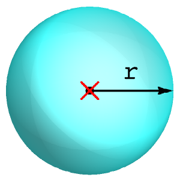

Hard sphere with radius `r`.

Shape traits:
* **Geometric center**: {0, 0, 0} (red cross)
* **Interaction centers**: geometric center
* **Shape axes**: None
* **Named points**:
  * `"o"` - geometric center
  * `"cm"` - mass center
* **Interactions**:
  * class `hard` - hard-core interaction
  * [class `lj`](#class-lj)
  * [class `wca`](#class-wca)
  * [class `square_inverse_core`](#class-square_inverse_core)


### Class `kmer`

```python
kmer(
    k,
    r,
    distance,
    interaction = hard
)
```

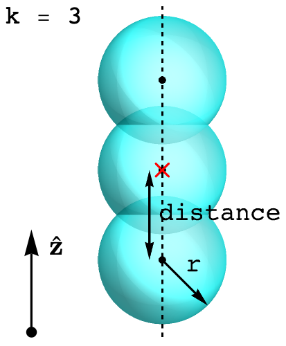

Colinear k-mer consisting of `k` identical spheres with radius `r` and identical distances equal `distance` between
them, lying on the z-axis. The spheres may partially overlap. The spheres at the end are equidistant from the geometric
center.

Shape traits:
* **Geometric center**: {0, 0, 0} (red cross)
* **Interaction centers**: center of each sphere
* **Shape axes**:
  * *primary* = {0, 0, 1}
* **Named points**:
  * `"o"` - geometric center
  * `"cm"` - mass center
  * `"si"` - the center of the `i`-th sphere, starting from 0 for the lowermost sphere to `k - 1` for the uppermost
    sphere
  * `"beg"` - equivalent to `"s0"`
  * `"end"` - equivalent to `"s[k - 1]"`
* **Interactions**:
  * class `hard` - hard-core interaction
  * [class `lj`](#class-lj)
  * [class `wca`](#class-wca)
  * [class `square_inverse_core`](#class-square_inverse_core)


### Class `polysphere_banana`

```python
polysphere_banana(
    sphere_n,
    sphere_r,
    arc_r,
    arc_angle,
    interaction = hard
)
```

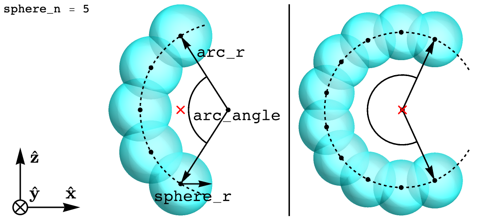

`sphere_n` identical spheres with radius `sphere_r` placed equidistantly on a circular arc with radius `arc_radius` and
the arc angle `arc_angle`. The arc lies in the xz plane. The arc angle is  symmetric w.r.t. the x-axis and its opens
toward the positive x-axis. If the angle is below 180&deg;, the geometric center lies in the middle between the 
endpoints of the arc. Otherwise, the geometric center lies in the arc center.

Shape traits:
* **Geometric center**: {0, 0, 0} (red cross)
* **Interaction centers**: center of each sphere
* **Shape axes**:
  * *primary* = {0, 0, 1}
  * *secondary* = {-1, 0, 0}
  * *auxiliary* = {0, -1, 0}
* **Named points**:
  * `"o"` - geometric center
  * `"cm"` - mass center
  * `"si"` - the center of the `i`-th sphere, starting from 0 for the endpoint sphere with negative z coordinate to
    `sphere_n - 1` for the endpoint sphere with positive z coordinate
  * `"beg"` - the arc endpoint with negative z coordinate (equivalent to `"s0"`)
  * `"end"` - the arc endpoint with positive z coordinate (equivalent to `"s[sphere_n - 1]"`)
* **Interactions**:
  * class `hard` - hard-core interaction
  * [class `lj`](#class-lj)
  * [class `wca`](#class-wca)
  * [class `square_inverse_core`](#class-square_inverse_core)


### Class `polysphere_lollipop`

```python
polysphere_lollipop(
    sphere_n,
    stick_r,
    tip_r,
    stick_penetration = 0,
    tip_penetration = 0
)
```

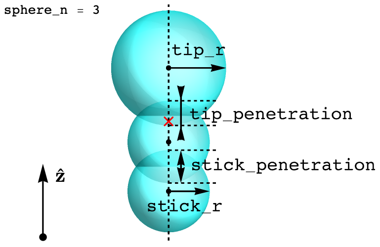

The shape similar to the [k-mer](#class-kmer), however the top sphere may have a radius different the rest of lower
spheres. There are `sphere_n - 1` identical spheres with radius `stick_r` placed on the z-axis (lollipop's stick) and a
different sphere with radius `large_r` at the top (lollipop's tip). The overlap between "stick" spheres is controlled by 
`stick_penetration` (where 0 means that the spheres are tangent), while the overlap between the "tip" sphere and the
uppermost "stick" sphere is controlled by `tip_penetration`. The spheres are placed in such a way that the uppermost
and lowermost points on the shape are equidistant from the geometric center.

Shape traits:
* **Geometric center**: {0, 0, 0} (red cross)
* **Interaction centers**: center of each sphere
* **Shape axes**:
  * *primary* = {0, 0, 1}
* **Named points**:
  * `"o"` - geometric center
  * `"cm"` - mass center (defined only if both penetrations are 0)
  * `"si"` - the center of the `i`-th sphere, starting from 0 for the lowermost sphere to `sphere_n - 1` for the
    uppermost sphere
  * `"ss"` - the center of the bottom sphere with radius `stick_r` (equivalent to `"s0"`)
  * `"st"` - the center of the top sphere with radius `"tip_r"` (equivalent to `"s[sphere_n - 1]"`)
* **Interactions**: only hard-core - spheres are polydisperse, while soft interactions currently do not support
  pair-wise interaction parameters


### Class `polysphere_wedge`

```python
polysphere_wedge(
    sphere_n,
    bottom_r,
    top_r,
    penetration = 0,
    interaction = hard
)
```

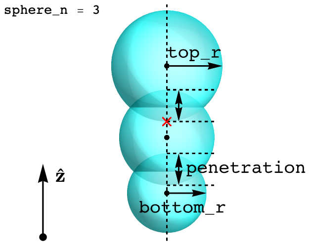

The linear polymer with `sphere_n` spheres placed on the z-axis, whose radii change linearly from `bottom_r` for the
bottom sphere to `top_r` for the top sphere. The overlap between the spheres is controlled by `penetration` (where
0 means that the spheres are tangent). The spheres are placed in such a way that the uppermost and lowermost points on
the shape are equidistant from the geometric center.

Shape traits:
* **Geometric center**: {0, 0, 0} (red cross)
* **Interaction centers**: center of each sphere
* **Shape axes**:
  * *primary* = {0, 0, 1}
* **Named points**:
  * `"o"` - geometric center (red cross)
  * `"cm"` - mass center (defined only if `penetration = 0`)
  * `"si"` - the center of the `i`-th sphere, starting from 0 for the lowermost sphere to `sphere_n - 1` for the
    uppermost sphere
  * `"beg"` - the center of the bottom sphere (equivalent to `"s0"`)
  * `"end"` - the center of the top sphere (equivalent to `"s[sphere_n - 1]"`)
* **Interactions**:  only hard-core - spheres are polydisperse, while soft interactions currently do not support
  pair-wise interaction parameters


### Class `spherocylinder`

```python
polysphere_wedge(
    l,
    r
)
```

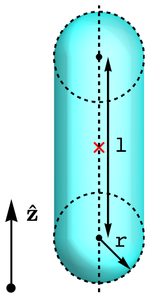

Spherocylinder, spanned along the z-axis - the union of a cylinder and spheres placed at the bases of the cylinder. The
distance between spheres' centers is `l` and the radius of the cylinder and the spheres is `r`.

Shape traits:
* **Geometric center**: {0, 0, 0} (red cross)
* **Interaction centers**: geometric center
* **Shape axes**:
  * *primary* = {0, 0, 1}
* **Named points**:
  * `"o"` - geometric center
  * `"cm"` - mass center
  * `"beg"` - the center of the bottom sphere
  * `"end"` - the center of the top sphere
* **Interactions**: only hard-core


### Class `polyspherocylinder_banana`

```python
polyspherocylinder_banana(
    segment_n,
    sc_r,
    arc_r,
    arc_angle,
    subdivisions = 1
)
```

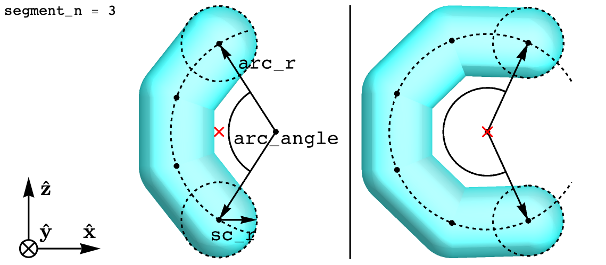

The shape is created by spanning `segment_n` identical segments on a circular arc with radius `arc_radius` and
the arc angle `arc_angle` and then building sperocylinders with radius `sc_r` around these segments (they become the
heights of cylinder parts of the spherocylinders). The arc lies in the xz plane. The arc angle is symmetric w.r.t. the
x-axis and its opens toward the positive x-axis. If the angle is below 180&deg;, the geometric center lies in the middle
between the endpoints of the arc. Otherwise, the geometric center lies in the arc center. The optional parameter
`subdivisions` controls into how many additional parts each spherocylinder should be divided to optimize the neighbor
grid performance.

Shape traits:
* **Geometric center**: {0, 0, 0} (red cross)
* **Interaction centers**: the midpoint of each spherocylinder's height; when `subdivisions > 1`, each subpart counts
  as an independent spherocylinder, thus the number of interaction centers is `segment_n * subdivisions`
* **Shape axes**:
  * *primary* = {0, 0, 1}
  * *secondary* = {-1, 0, 0}
  * *auxiliary* = {0, -1, 0}
* **Named points**:
  * `"o"` - geometric center
  * `"cm"` - mass center
  * `"oi"`, `"bi"`, `"ei"` - midpoint (`o`), beginning (`b`) or end (`e`) of the `i`-th spherocylinder. The
    numbering starts from 0 for the spherocylinder containing the beginning of the arc (the endpoint with
    a negative z coordinates) and the index `i` increases towards the end of the arc. Spherocylinder's beginning (`b`)
    and end (`e`) points follow the same ordering. Please note that when `subdivisions > 1`, the divided parts count as
    separate spherocylinders, thus, for example the first arc segment is actually built of spherocylinders with indices
    `i = 0, 1, ..., subdivisions - 1`.
  * `"beg"` - the arc endpoint with negative z coordinate (equivalent to `"b0"`)
  * `"end"` - the arc endpoint with positive z coordinate (equivalent to `"e[subdivisions * sphere_n - 1]"`)
* **Interactions**: only hard-core


### Class `smooth_wedge`

```python
smooth_wedge(
    l,
    bottom_r,
    top_r,
    subdivisions = 1
)
```


The shape which is given by the convex hull of two spheres with radii `bottom_r` and `top_r` placed on the z-axis and
distance `l` between them. The spheres are placed in such a way that the uppermost and lowermost points on the shape are
equidistant from the geometric center. The optional parameter `subdivisions` controls into how many parts the wedge
should be divided to optimize the neighbor grid performance.

Shape traits:
* **Geometric center**: {0, 0, 0} (red cross)
* **Interaction centers**: if `subdivisions > 1`, geometric center of each part, otherwise the geometric center of the
  whole shape
* **Shape axes**:
  * *primary* = {0, 0, 1}
* **Named points**:
  * `"o"` - geometric center
  * `"beg"` - the center of the bottom sphere
  * `"end"` - the center of the top sphere
* **Interactions**: only hard-core


### Class `polyhedral_wedge`

```python
polyhedral_wedge(
    bottom_ax,
    bottom_ay,
    top_ax,
    top_ay,
    l,
    subdivisions = 1
)
```


A polyhedron built by joining two axis-oriented rectangles placed on the XY planes with z coordinates equal `-l/2` and
`l/2`. The side lengths of the bottom (`z = -l/2`) rectangle are given by `bottom_ax` and `bottom_ay`, while `top_ax`
and `top_az` control the size of the top (`z = l/2`) rectangle. Please note that since the geometric center is in the
midpoint of length of the polyhedron, the circumsphere may not be optimal. If `subdivisions > 1`, the polyhedron is
divided into that many parts along its length to optimize neighbor grid performance.

Shape traits:
* **Geometric center**: {0, 0, 0} (red cross)
* **Interaction centers**: if `subdivisions > 1`, length midpoints of each part, otherwise the length midpoint of the
  whole shape (geometric center)
* **Shape axes**:
  * *primary* = {0, 0, 1}
  * *secondary* = {1, 0, 0}
  * *auxiliary* = {0, 1, 0}
* **Named points**:
  * `"o"` - geometric center
  * `"beg"` - the midpoint of the bottom rectangle
  * `"end"` - the midpoint of the top rectangle
* **Interactions**: only hard-core


## General shape classes

This section contains general shape classes with an extensive control over the shape. Especially flexible is the
[class `generic_convex`](#class-generic_convex), which, basing on Minkowski sums and convex hulls of predefined
primitive building blocks enables ones to craft most of reasonably-shaped convex particles. The list includes

* [Class `polysphere`](#class-polysphere)
* [Class `polyspherocylinder`](#class-polyspherocylinder)
* [Class `generic_convex`](#class-generic_convex)


### Class `polysphere`

```python
polysphere(
    spheres,
    volume,
    geometric_center = [0, 0, 0],
    primary_axis = None,
    secondary_axis = None,
    named_points = {},
    interaction = hard
)
```


A generic union of spheres.

Arguments:

* ***spheres***

  `sphere` object or an Array of `sphere` objects:

  ```python
  sphere(
      pos,
      r
  )
  ```
  
  where `r` is radius and `pos` can be either a single position (Array of 3 Floats) representing a single sphere or an
  Array of positions (Array of Arrays of 3 Floats), which represents many spheres with the same radius `r`. As an
  example, the shape from the illustration can be created using

  ```python
  spheres=[
      sphere(pos=[0, 0, 0], r=0.7),                                             # central sphere
      sphere(pos=[[-1,0,0],[1,0,0],[0,1,0],[0,-1,0],[0,0,1],[0,0,-1]], r=0.5)   # "satellite" spheres
  ]
  ```

  **IMPORTANT NOTE**: For best performance, choose shape positions in a way that optimizes their distances from
  the origin {0, 0, 0}:

  ```python
  sphere(pos=[[0, 0, 0], [0, 0, 1]], r=0.5)
  sphere(pos=[[0, 0, -0.5], [0, 0, 0.5]], r=0.5)
  ```

  Both cases are the same dimer, however the first one is centered in {0, 0, 0.5} and has a suboptimal circumsphere
  radius equal 1.5, while the second one is centered in {0, 0, 0} and has the optimal circumsphere radius equal 1.

* ***volume***

  Volume of the shape. Unfortunately, automatic volume calculation of many overlapping spheres is notoriously difficult;
  thus the user has to do it manually for the specific case.

* ***geometric_center*** (*= [0, 0, 0]*)

  The geometric center, which may be different than {0, 0, 0}.

* ***primary_axis*** (*= None*)

  The primary axis of the shape - Array of 3 Floats. It does not have to be normalized (the normalization is done
  automatically). If the shape does not have the primary axis, `None` should be passed instead.

* ***secondary_axis*** (*= None*)

  The secondary axis of the shape - Array of 3 Floats. It does not have to be normalized (the normalization is done
  automatically). If the shape does not have the primary axis, `None` should be passed instead. `secondary_axis` can
  be defined only if `primary_axis` is not `None`.

* ***named_points*** (*= {}*)

  The Dictionary of custom named points, where the keys are Strings representing point names, while the values are
  Arrays of 3 Floats representing the positions of the named points.

* ***interation*** (*= hard*)

  Interaction between pairs of spheres. See *Shape traits* below for a list of supported interactions. <br />
  **IMPORTANT NOTE**: currently, if a soft interaction is chosen, all pairs of spheres interact via the same potential
  (with the same potential parameters), even if spheres have different radii. It is not the case for the hard-core
  interaction, where the radii are respected.

Shape traits:
* **Geometric center**: as specified by `geometric_center`
* **Interaction centers**: centers of spheres
* **Shape axes**: as specified by `primary_axis` and `secondary axis` (auxiliary axis is computed automatically)
* **Named points**:
  * `"o"` - geometric center
  * `"si"` - the center of `i`-th sphere, starting from 0
  * custom ones given by `named_points`
* **Interactions**:
  * class `hard` - hard-core interaction
  * [class `lj`](#class-lj)
  * [class `wca`](#class-wca)
  * [class `square_inverse_core`](#class-square_inverse_core)


### Class `polyspherocylinder`

```python
polyspherocylinder(
    scs,
    volume,
    geometric_center = [0, 0, 0],
    primary_axis = None,
    secondary_axis = None,
    named_points = {}
)
```

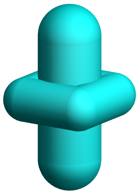

A generic union of spherocylinders.

Arguments:

* ***scs***

  `sc` object or an Array of `sc` objects:

  ```python
  sc(
      chain,
      r
  )
  ```

  Class `sc` represents a chain of spherocylinders. Namely, `chain` is an Array of at least 2 points (where the point is
  Array of 3 Floats) forming a line, around which the spherocylinders are built. `r` the radius of the spherocylinders.
  As an example, the shape from the illustration can be created using

  ```python
  scs=[
      sc(chain=[[0,0,-2],[0,0,2]], r=1),                                # middle spherocylinder     
      sc(chain=[[-1,-1,0],[1,-1,0],[1,1,0],[-1,1,0],[-1,-1,0]], r=0.7)  # the "brim" (or halo?)
  ]
  ```

  **IMPORTANT NOTE**: For best performance, choose shape positions in a way that optimizes their distances from the
  origin {0, 0, 0}:

  ```python
  sc(chain=[[0,0,0],[2,0,0],[2,2,0],[0,2,0],[0,0,0]], r=0.7)
  sc(chain=[[-1,-1,0],[1,-1,0],[1,1,0],[-1,1,0],[-1,-1,0]], r=0.7)
  ```
  
  Both cases are the same shapes, however the first one is centered in {0, 1, 1} and has a suboptimal circumsphere
  radius equal 0.7 + 2&radic;2, while the second one is centered in {0, 0, 0} and has the optimal circumsphere radius
  equal 0.7 + &radic;2.

* ***volume***

  Volume of the shape. Unfortunately, automatic volume calculation of many overlapping spherocylinders is notoriously
  difficult; thus the user has to do it manually for the specific case.

* ***geometric_center*** (*= [0, 0, 0]*)

  The geometric center, which may be different than {0, 0, 0}.

* ***primary_axis*** (*= None*)

  The primary axis of the shape - Array of 3 Floats. It does not have to be normalized (the normalization is done
  automatically). If the shape does not have the primary axis, `None` should be passed instead.

* ***secondary_axis*** (*= None*)

  The secondary axis of the shape - Array of 3 Floats. It does not have to be normalized (the normalization is done
  automatically). If the shape does not have the primary axis, `None` should be passed instead. `secondary_axis` can
  be defined only if `primary_axis` is not `None`.

* ***named_points*** (*= {}*)

  The Dictionary of custom named points, where the keys are Strings representing point names, while the values are
  Arrays of 3 Floats representing the positions of the named points.

Shape traits:
* **Geometric center**: as specified by `geometric_center`
* **Interaction centers**: centers of spherocylinders
* **Shape axes**: as specified by `primary_axis` and `secondary axis` (auxiliary axis is computed automatically)
* **Named points**:
  * `"o"` - geometric center
  * `"oi"` - the center of `i`-th spherocylinder, starting from 0
  * `"bi"` - the first endpoint of `i`-th spherocylinder, starting from 0
  * `"ei"` - the second endpoint of `i`-th spherocylinder, starting from 0
  * custom ones given by `named_points`
* **Interactions**: only hard-core


### Class `generic_convex`

```python
generic_convex(
    geometry,
    volume,
    geometric_center = [0, 0, 0],
    primary_axis = None,
    secondary_axis = None,
    named_points = {}
)
```

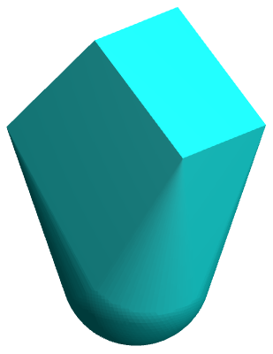

Generic convex shape constructed from primitive building blocks (such as points, segments, spheres, etc.) and geometric
operations (Minkowski sum, Minkowski difference, convex hull). The overlap check is done using
[XenoCollide](http://xenocollide.snethen.com) algorithm of Gary Snethen.

Arguments:

* ***geometry***

  The geometry of the shape. It is given by primitive building blocks and geometric operation on them. For example

  ```python
  geometry=wrap(
      sphere(r=0.5, pos=[0, 0, -0.5]),
      cuboid(ax=1, ay=1, az=1, pos=[0, 0, 0.5], rot=[45, 0, 0])
  )
  ```

  is a convex hull (`wrap`) of a sphere and a cube and recreates the shape from the illustration above.

  **PRIMITIVE BLOCKS**:

  * Class `point`

    ```python
    point(
        pos
    )
    ```

    

    A point with position `pos` (Array of 3 Floats).
  
  * Class `segment` 

    ```python
    segment(
        l,
        pos = [0, 0, 0],
        rot = [0, 0, 0]
    )
    ```

    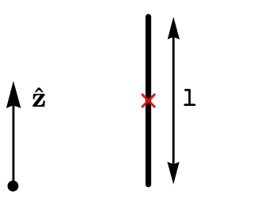
  
    A segment, which for the default values of `pos` and `rot` is spanned between `[0, 0, -l/2]` and `[0, 0, l/2]`.
    `pos` (Array of 3 Floats) specifies its center. `rot` specifies its orientation - it is an Array of 3 Tait-Bryan
    angles (in degrees), where subsequent elements are angles of rotations around, respectively, x, y and z axis,
    performed in a given order.

  * Class `rectangle`

    ```python
    rectangle(
        ax,
        ay,
        pos = [0, 0, 0],
        rot = [0, 0, 0]
    )
    ```

    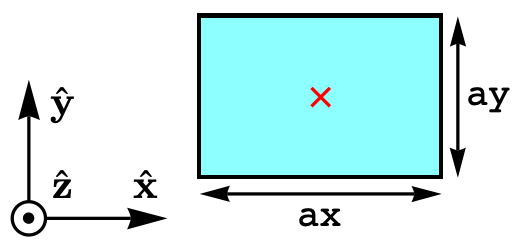

    A rectangle with midpoint `pos` (Array of 3 Floats). By default, it lies on the xy plane and `ax` and `ay` are its
    side lengths along, respectively, x and y axis. `rot` specifies its orientation - it is an Array of 3 Tait-Bryan
    angles (in degrees), where subsequent elements are angles of rotations around, respectively, x, y and z axis,
    performed in a given order.

  * Class `cuboid`

    ```python
    cuboid(
        ax,
        ay,
        az,
        pos = [0, 0, 0],
        rot = [0, 0, 0]
    )
    ```
   
    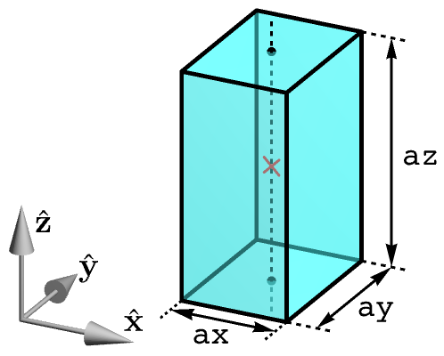

    A cuboid with midpoint `pos` (Array of 3 Floats). By default, it is axis-oriented and `ax`, `ay`, `az` are its side
    lengths along, respectively, x, y and z axis. `rot` specifies its orientation - it is an Array of 3 Tait-Bryan
    angles (in degrees), where subsequent elements are angles of rotations around, respectively, x, y and z axis,
    performed in a given order.

  * Class `disk`

    ```python
    disk(
        r,
        pos = [0, 0, 0],
        rot = [0, 0, 0]
    )
    ```  
 
    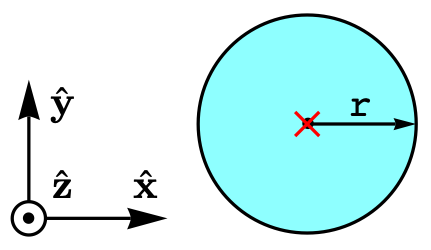   
  
    A disk with radius `r` and center `pos` (Array of 3 Floats). By default, it lies on the xy plane. `rot` specifies
    its orientation - it is an Array of 3 Tait-Bryan angles (in degrees), where subsequent elements are angles of
    rotations around, respectively, x, y and z axis, performed in a given order.

  * Class `sphere`

    ```python
    sphere(
        r,
        pos = [0, 0, 0]
    )
    ```  

     

    A sphere with radius `r` and center `pos` (Array of 3 Floats).

  * Class `ellipse`

    ```python
    ellipse(
        rx,
        ry,
        pos = [0, 0, 0],
        rot = [0, 0, 0]
    )
    ```

    

    An ellipse with midpoint `pos` (Array of 3 Floats). By default, it lies on the xy plane and `rx` and `ry` are its,
    respectively, x and y semi-axes. `rot` specifies its orientation - it is an Array of 3 Tait-Bryan angles (in
    degrees), where subsequent elements are angles of rotations around, respectively, x, y and z axis, performed in a
    given order.

  * Class `ellipsoid`

    ```python
    ellipsoid(
        rx,
        ry,
        rz,
        pos = [0, 0, 0],
        rot = [0, 0, 0]
    )
    ```

    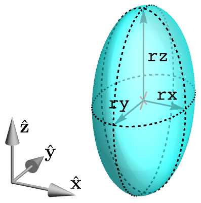

    An ellipsoid with midpoint `pos` (Array of 3 Floats). By default, it is axis-oriented and `rx`, `ry` and `rz` are
    its, respectively, x, y and z semi-axes. `rot` specifies its orientation - it is an Array of 3 Tait-Bryan angles (in
    degrees), where subsequent elements are angles of rotations around, respectively, x, y and z axis, performed in a
    given order.

  * Class `saucer`

    ```python
    saucer(
        r,
        l,
        pos = [0, 0, 0],
        rot = [0, 0, 0]
    )
    ```
    
    
  
    A shape created by joning two spherical caps with such dimensions that the distance between cap "tips" is `l` and
    the radius of a circle where the caps meet is `r`. Shape's midpoint is `pos` (Array of 3 Floats). By default, the
    circle lies in the xy plane. `rot` specifies shape's orientation - it is an Array of 3 Tait-Bryan angles (in
    degrees), where subsequent elements are angles of rotations around, respectively, x, y and z axis, performed in a
    given order.

  * Class `football`

    ```python
    football(
        r,
        l,
        pos = [0, 0, 0],
        rot = [0, 0, 0]
    )
    ```
    
    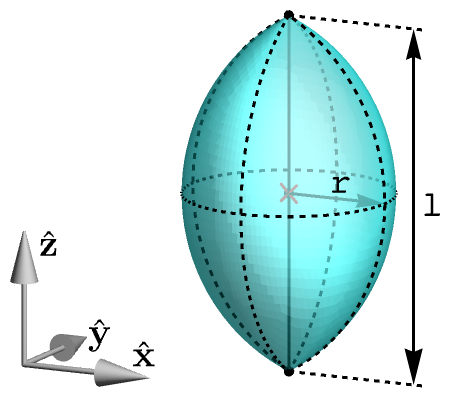

    A shape, which for the default values of `pos` and `rot` is created by rotating a circle arc with endpoints lying on
    the z axis around the z axis. Arc radius and angle are such that the distance between the endpoints is `l` and the
    resulting shape has radius `r` in its thickest place. Shape's midpoint is `pos` (Array of 3 Floats). `rot` specifies
    shape's orientation - it is an Array of 3 Tait-Bryan angles (in degrees), where subsequent elements are angles of
    rotations around, respectively, x, y and z axis, performed in a given order.

  **GEOMETRIC OPERATIONS**:

  * Class `sum`

    ```python
    sum(
        *args
    )
    ```
    
    [Minkowski sum](https://en.wikipedia.org/wiki/Minkowski_addition) of all geometries given by variadic arguments
    `*args`. Elements of `*args` can be both primitives and results of other geometric operations.
  
    **IMPORTANT NOTE**: For all geometries which are primitives, avoid changing the `pos` argument - unnecessary
    translations yield suboptimal circumsphere radius.

  * Class `diff`

    ```python
    diff(
        g1,
        g2
    )
    ```

    [Minkowski difference](https://en.wikipedia.org/wiki/Minkowski_addition) of geometries `g1` an `g2` - Minkowski sum
    of `g1` and symmetrically reflected `g2`. `g1` and `g2` can be both primitives and results of other geometric
    operations.

    **IMPORTANT NOTE**: For geometries which are primitives, avoid changing the `pos` argument - unnecessary
    translations yield suboptimal circumsphere radius.

  * Class `wrap`

    ```python
    wrap(
        *args
    )
    ```

    [Convex hull](https://en.wikipedia.org/wiki/Convex_hull) of all geometries given by variadic arguments `*args`.
    Elements of `*args` can be both primitives and results of other geometric operations.

    **IMPORTANT NOTE**: For best performance, choose shape positions in a way that optimizes their distances from
    the origin {0, 0, 0}:

    ```python
    wrap(sphere(r=0.5, pos=[0, 0, 0]), sphere(r=0.5, pos=[0, 0, 2]))
    wrap(sphere(r=0.5, pos=[0, 0, -1]), sphere(r=0.5, pos=[0, 0, 1]))
    ```
    
    Both cases are the same spherocylinder, however the first one is centered in {0, 0, 1} and has a suboptimal
    circumsphere radius equal 2.5, while the second one is centered in {0, 0, 0} and has the optimal circumsphere radius
    equal 1.5.

* ***volume***

  Volume of the shape.

* ***geometric_center*** (*= [0, 0, 0]*)

  The geometric center, which may be different than {0, 0, 0}.

* ***primary_axis*** (*= None*)

  The primary axis of the shape - Array of 3 Floats. It does not have to be normalized (the normalization is done
  automatically). If the shape does not have the primary axis, `None` should be passed instead.

* ***secondary_axis*** (*= None*)

  The secondary axis of the shape - Array of 3 Floats. It does not have to be normalized (the normalization is done
  automatically). If the shape does not have the primary axis, `None` should be passed instead. `secondary_axis` can
  be defined only if `primary_axis` is not `None`.

* ***named_points*** (*= {}*)

  The Dictionary of custom named points, where the keys are Strings representing point names, while the values are
  Arrays of 3 Floats representing the positions of the named points.

Shape traits:
* **Geometric center**: as specified by `geometric_center`
* **Interaction centers**: None
* **Shape axes**: as specified by `primary_axis` and `secondary axis` (auxiliary axis is computed automatically)
* **Named points**:
  * `"o"` - geometric center
  * custom ones given by `named_points`
* **Interactions**: only hard-core


## Soft interaction classes

This section lists all soft interaction types available for selected shapes. The list includes

* [Class `lj`](#class-lj)
* [Class `wca`](#class-wca)
* [Class `square_inverse_core`](#class-square_inverse_core)


### Class `lj`

```python
lj(
    epsilon,
    sigma
)
```

[Lennard-Jones](https://en.wikipedia.org/wiki/Lennard-Jones_potential) interaction between all pairs of interaction
centers, defined as

*E*(*r*) = 4&epsilon;[(&sigma;/*r*)<sup>12</sup> - (&sigma;/*r*)<sup>6</sup>],

where *r* is the distance between the interaction centers. The interaction has cut-off radius of *r* = 3&sigma;, which
is a widely accepted trade-off between accuracy and computational efficiency.

**Supported by**: [class `sphere`](#class-sphere), [class `kmer`](#class-kmer),
[class `polysphere_banana`](#class-polysphere_banana), [class `polysphere`](#class-polysphere).


### Class `wca`

```python
wca(
    epsilon,
    sigma
)
```

[Weeks-Chandler-Andersen](https://doi.org/10.1063/1.1674820) interaction between all pairs of interaction centers. It is
based on a repulsive part of the Lennard-Jones potential and is defined as

|                                                                                           |                                   |
|-------------------------------------------------------------------------------------------|-----------------------------------|
| *E*(*r*) = &epsilon; + 4&epsilon;[(&sigma;/*r*)<sup>12</sup> - (&sigma;/*r*)<sup>6</sup>] | for r < 2<sup>1/6</sup>&sigma;    |
| *E*(*r*) = 0                                                                              | for r &ge; 2<sup>1/6</sup>&sigma; |

where *r* is the distance between the interaction centers. The interaction has a range of r = 2<sup>1/6</sup>&sigma;.
After that point, it is zero.

**Supported by**: [class `sphere`](#class-sphere), [class `kmer`](#class-kmer),
[class `polysphere_banana`](#class-polysphere_banana), [class `polysphere`](#class-polysphere).


### Class `square_inverse_core`

```python
square_inverse_core(
    epsilon,
    sigma
)
```

Short-ranged repulsive interaction between all pairs of interaction centers decreasing with the inverse square of
distance, defined as

|                                                     |                    |
|-----------------------------------------------------|--------------------|
| *E*(*r*) = &epsilon;[(&sigma;/*r*)<sup>2</sup> - 1] | for r < &sigma;    |
| *E*(*r*) = 0                                        | for r &ge; &sigma; |

where *r* is the distance between the interaction centers. It is useful especially in
[overlap relaxation](input-file.md#class-overlap_relaxation) as a soft
[helper interaction](input-file.md#overlaprelaxation_helpershape) because of shorter computation time compared to
for example [WCA potential](#class-wca).

**Supported by**: [class `sphere`](#class-sphere), [class `kmer`](#class-kmer),
[class `polysphere_banana`](#class-polysphere_banana), [class `polysphere`](#class-polysphere).


[&uarr; back to the top](#shapes)